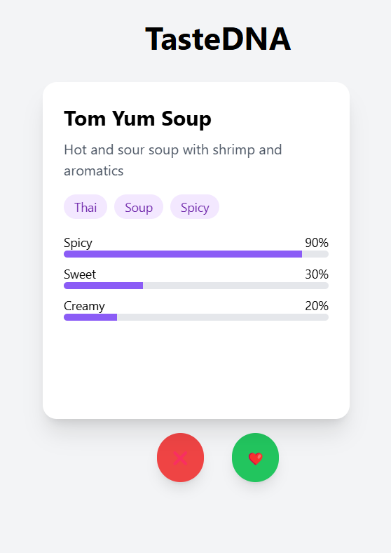
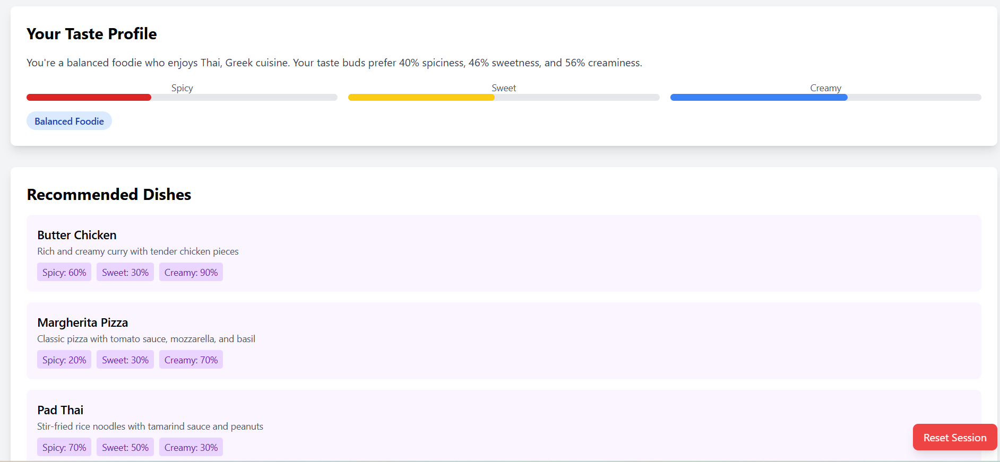

# TasteDNA 🍽️

A smart food recommendation system designed to tackle choice paralysis by helping you discover your true taste preferences.

## Screenshots

*The main interface showing the swipeable dish cards and interactive buttons*

*Your personalized taste profile and recommendations*

## What is TasteDNA?

TasteDNA is an interactive web application that analyzes your food preferences through a simple swipe interface. By liking or disliking dishes, it builds a personalized taste profile and recommends dishes you'll love.

## Key Features

- 🎯 Smart dish recommendations based on your preferences
- 🔥 Personalized taste profile analysis
- 🍜 Interactive swipe interface
- 🎨 Beautiful, modern UI with Tailwind CSS
- 🤖 AI-powered insights about your food preferences

## How It Works

1. Swipe through dishes (❤️ for like, ❌ for dislike)
2. After liking 3+ dishes, get personalized recommendations
3. View your unique taste profile and foodie type

## Tech Stack

- Python/Flask backend
- Modern JavaScript frontend
- Tailwind CSS for styling
- AI/ML API for intelligent recommendations

## Getting Started

1. Clone the repository
2. Install dependencies: `pip install -r requirements.txt`
3. Set up your environment variables in `.env`
4. Run the app: `python app.py`
5. Visit `http://localhost:5000`

## License

MIT License 
